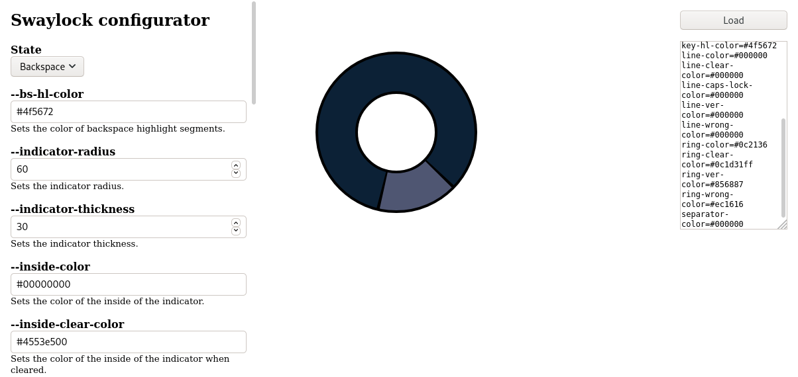

# swaylock-configurator

Visualize changes to [swaylock's](https://github.com/swaywm/swaylock) configuration.

**WORK IN PROGRESS!**

[Live Demo](https://squiddy.github.io/swaylock-configurator/)

## Screenshot

